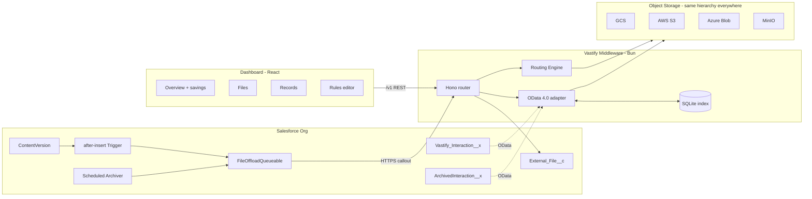

# Vastify — Transparent Storage Offload for Salesforce

Salesforce charges ~$250/GB/month for additional data storage and ~$5/GB/month for file storage. Vastify is a middleware platform that transparently offloads both **files** (ContentVersion attachments) and **records** (SObject rows) onto the customer's own object storage on AWS, GCP, or Azure — while Salesforce end-users continue to browse, search, and edit them as if they were native.

Built for a hackathon; this repo contains everything end-to-end:

- **Middleware** — a Bun + TypeScript server (`api/`) with a pluggable object-backend layer (S3, GCS, Azure Blob, MinIO), a rule-based routing engine, and an OData 4.0 adapter.
- **Salesforce package** — Apex trigger, Queueable, Scheduled archiver, custom SObjects, External Objects, and a permission set (`salesforce/`).
- **Dashboard** — a React + Vite SPA showing live savings, cost breakdowns, per-cloud distribution, and a rule editor (`dashboard/`).

---

## Architecture



Everything in object storage lives at one hierarchy, on every cloud:

```
tenants/
  {tenantId}/
    files/{fileId}                                  ← binary blobs
    records/{entity}/{pk}.json                      ← one record per JSON object
```

A SQLite metadata DB (`bun:sqlite`) acts as a rebuildable index of filterable fields for OData `$filter` — lose it, reconcile from the bucket.

See [`docs/ARCHITECTURE.md`](docs/ARCHITECTURE.md) for the full design doc and design tradeoffs.

---

## Demo flow

1. Upload a PDF to any **Contact** in Salesforce.
2. An `after-insert` trigger fires `FileOffloadQueueable`, which calls our middleware. The bytes land in your GCS / S3 / Azure bucket, a presigned URL is stored on a new `External_File__c` record, and (optionally) the original `ContentVersion` is deleted to reclaim Salesforce storage.
3. Browse the **Vastify Interaction** tab in Salesforce — each row is served by a live OData call to our middleware (records live in object storage, not Salesforce data storage).
4. Hit "Archive Now" from the dashboard → 432 old `Interaction__c` rows are bulk-POSTed to `/v1/records/archive`, deleted from Salesforce, and reappear instantly under the **Archived Interaction** tab (same data source, different entity set).
5. The dashboard shows the **net savings** ticker updating in real time.

---

## Quickstart

### Prerequisites

| Tool | Version | Purpose |
|---|---|---|
| [Bun](https://bun.sh) | 1.3+ | API runtime, test runner, package manager |
| Node.js | 20+ | Runs the Vite dev server |
| Docker | any recent | Runs MinIO locally |
| [Salesforce CLI (`sf`)](https://developer.salesforce.com/tools/salesforcecli) | 2.x | Deploys the SF package |
| [ngrok](https://ngrok.com/) | 3.20+ | Public tunnel so Salesforce can reach the local API |

### 1. Start the object backend

```bash
docker compose up -d
```

This brings up MinIO on `:9000` and creates the `vastify-demo` bucket.

### 2. Start the API

```bash
cp .env.example api/.env           # Bun reads .env from cwd
cd api
bun install
bun run seed                       # seeds a demo tenant + default routing rules
bun run seed:demo                  # optional: seeds 5 files + 40 live + 200 archived records
bun run dev                        # serves on http://localhost:3099
```

### 3. Start the dashboard

```bash
cd dashboard
bun install
bun run dev                        # http://localhost:5173
```

### 4. Deploy the Salesforce package

```bash
cd salesforce
sf org login web --alias vastify
ngrok http 3099                    # copy the https://*.ngrok-free.app URL
```

Update `force-app/main/default/remoteSiteSettings/Vastify_API.remoteSite-meta.xml` and `force-app/main/default/customMetadata/Vastify_Setting.Default.md-meta.xml` with your ngrok URL, then:

```bash
sf project deploy start --target-org vastify
sf org assign permset --target-org vastify --name Vastify_Admin
sf apex run --target-org vastify --file scripts/configure-setting.apex   # upserts the metadata record
sf apex run --target-org vastify --file scripts/seed.apex                # 500 Interactions over 2 years
```

> **Agentforce / fresh Developer Edition orgs:** the External Data Source must be created through **Setup → External Data Sources → New External Data Source** (not via metadata). Use `Vastify OData` as the label, `Vastify_OData` as the name, `OData 4.0`, URL `<your-ngrok>/odata/v1/`, `Anonymous` principal, `No Authentication`. Then click **Validate and Sync** and tick both entities. If `Interaction` fails to sync due to a naming collision, rename it to `Vastify_Interaction` in the form and retry. See [`docs/SALESFORCE.md`](docs/SALESFORCE.md) for the full deploy guide.

### 5. Verify

From the same `salesforce/` directory:

```bash
sf apex run --file scripts/test-file-offload.apex    # inserts a ContentVersion → middleware → MinIO
sf apex run --file scripts/check-external-object.apex # queries External Objects via SF Connect
sf apex run --file scripts/test-archive.apex         # archives >90-day Interactions
```

Open the **Vastify** app in Salesforce and click through the tabs — the live External Object rows are served directly from your middleware.

---

## Project structure

```
.
├── api/                      # Bun + TypeScript middleware
│   ├── src/
│   │   ├── server.ts         # Hono + Bun.serve entry
│   │   ├── object/           # ObjectBackend interface + S3/GCS/Azure/MinIO impls
│   │   ├── routing/          # Rule-based routing engine
│   │   ├── files/            # File upload / refresh-URL endpoints
│   │   ├── records/          # CRUD over the SQLite index + object backends
│   │   ├── odata/            # OData 4.0 parser, SQL translator, HTTP handler
│   │   ├── stats/            # Cost math + SSE event stream
│   │   ├── rules/            # Rules CRUD endpoints
│   │   ├── auth/             # API-key middleware
│   │   └── db/               # SQLite schema + client
│   └── test/                 # bun test — routing, OData parser, MinIO contract
├── dashboard/                # React + Vite + Tailwind + Recharts SPA
│   └── src/
│       ├── pages/            # Overview, Files, Records, Rules, Tenants
│       ├── components/       # shared primitives
│       ├── hooks/            # useStatsStream (live polling)
│       └── lib/              # API client + formatters
├── salesforce/               # SFDX project
│   ├── force-app/main/default/
│   │   ├── classes/          # VastifyCallout, FileOffloadQueueable, ArchivedInteraction{Schedulable,Queueable}, tests
│   │   ├── triggers/         # ContentVersionTrigger
│   │   ├── objects/          # External_File__c, Interaction__c, Vastify_Setting__mdt
│   │   ├── customMetadata/   # Vastify_Setting.Default
│   │   ├── remoteSiteSettings/
│   │   ├── permissionsets/   # Vastify_Admin (grants FLS + tabs)
│   │   ├── applications/     # Vastify Lightning app
│   │   └── tabs/
│   └── scripts/              # Apex anonymous scripts for deploy-time setup + demo
├── docs/
│   ├── ARCHITECTURE.md       # full design doc
│   └── SALESFORCE.md         # SF-specific deploy guide + troubleshooting
├── docker-compose.yml        # MinIO
├── .env.example              # copy to api/.env
└── README.md
```

---

## Development

```bash
# API
cd api
bun test               # 31 tests: routing, OData parser, object-backend contract (vs live MinIO)
bun run typecheck      # tsc --noEmit

# Dashboard
cd dashboard
bun run typecheck
bun run build
```

The object-backend contract test (`api/test/object-backend.test.ts`) runs against any `ObjectBackend` implementation — by default MinIO, but the same suite validates S3 / GCS / Azure when their credentials are set.

---

## Configuration

All configuration is via environment variables. See [`.env.example`](.env.example) for the full list. The main knobs:

| Var | Default | Purpose |
|---|---|---|
| `PORT` | `3099` | Middleware HTTP port |
| `MINIO_*`, `GCS_*`, `S3_*`, `AZURE_*` | | Per-backend creds; set `*_ENABLED=true` to register |
| `DEMO_TENANT_API_KEY` | `vastify_demo_key_change_me` | API key seeded into SQLite — SF's Named Credential header |
| `VASTIFY_DEMO_PUBLIC_ODATA` | `true` | **Demo only.** Lets Salesforce Connect hit `/odata/v1/*` without a key. Disable in production and use a Named Credential / External Credential. |
| `PRESIGN_TTL_SEC` | `86400` (24h) | Presigned URL TTL stored on `External_File__c` |

---

## Known limits (hackathon scope)

- **Large files (>6 MB)** rely on Apex heap — a production deploy would move to direct browser-to-cloud uploads via presigned `PUT` URLs.
- **OData `$filter` is capped to indexed fields** — `Timestamp`, `Channel`, `Type`, `AccountId`, `ContactId`, `Subject`, `IsArchived`. Filters on other fields return HTTP 501. Adding a field to the SQLite index is one schema migration + one denormalised-write change.
- **Record writes are not transactional** across index + bucket — a crash between `PUT` and index insert leaves an orphan object, reconcilable from the bucket.
- **Single-region demo.** Multi-region replication is out of scope.
- **Auth is API-key for REST, anonymous for OData** in demo mode. Production should use Named Credentials + External Credentials for Salesforce Connect.
- **MinIO ignores storage-class hints** (they're tracked in SQLite but not sent to MinIO, which only supports `STANDARD` by default). GCS / S3 / Azure honour them natively.

---

## License

MIT — see [`LICENSE`](LICENSE).
