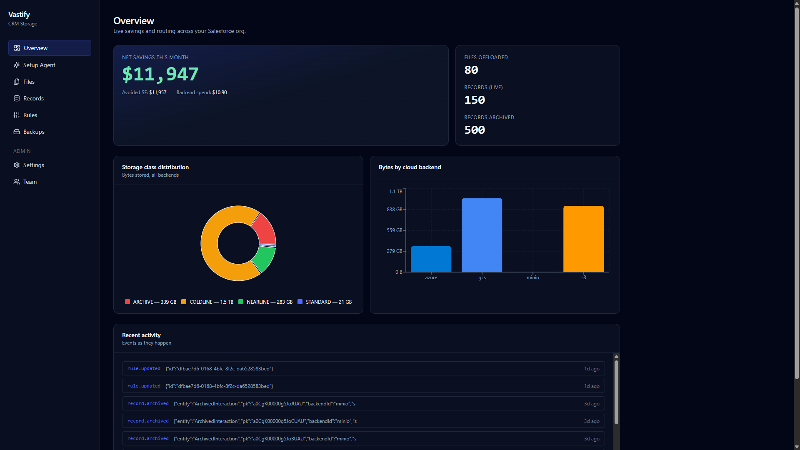
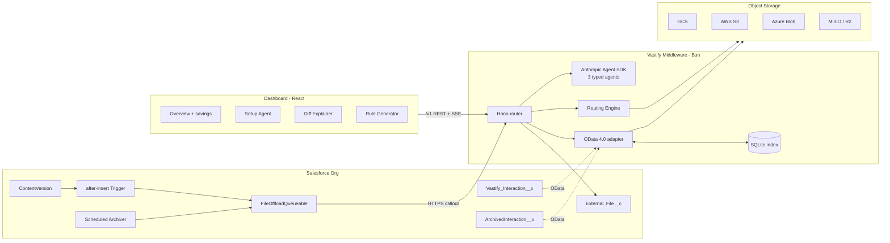

<div align="center">

# Vastify

**CRM storage and backup, with Claude inside.**

Salesforce charges around **$250 per gigabyte per year** to store your data. Vastify makes it **10× cheaper** by quietly routing your files into a cloud bucket you already own — without breaking a single Salesforce app that depends on it.

[](https://anthropic.com)
[](https://docs.anthropic.com)
[](https://bun.sh)
[](https://react.dev)
[](https://developer.salesforce.com)
[](LICENSE)
[](https://www.linkedin.com/in/james-collard-6b925a313/)

[**📺 Watch the 3-minute demo**](https://youtu.be/_OcVUofbFTM) &middot; [**🚀 Quickstart**](#quickstart) &middot; [**🤖 The AI agents**](#the-three-ai-agents) &middot; [**🏗 Architecture**](#architecture)



</div>

---

## What it is

Vastify is a transparent storage-offload + backup platform for Salesforce. It sits **invisibly between your Salesforce org and a cloud bucket you already own** (S3, GCS, Azure, R2, MinIO). It proxies the same OData endpoint Salesforce was serving, so every dependent app keeps reading attachments and records exactly the same way — but the actual bytes now live in **customer-owned, AES-256-encrypted, tier-routed object storage** at roughly 1/100th the cost.

Three Claude-powered agents do the rest:

| Agent | What it does | How |
|---|---|---|
| **Setup Agent** | Installs Vastify in **42 seconds**: inspects your org, picks the cheapest backend, deploys the SF package, verifies the OData endpoint | Anthropic Agent SDK · 6 typed tools · autonomous loop · SSE streamed to the UI |
| **Diff Explainer** | Reads a backup change-set and tells you exactly which objects are **safe to restore**, which need a human glance, and which would corrupt your schema | Structured outputs · per-object verdict + reasoning |
| **Rule Generator** | Turns plain-English routing intent (*"move all contracts older than 90 days to Glacier and ping the AE in Slack"*) into validated JSON | JSON-schema-validated tool · regenerates on validation failure |

All three run on **Claude Opus 4.7** via the Anthropic Agent SDK, wired into the Node API where they integrate with auth, the SQLite metadata store, and the Salesforce connector.

---

## The three AI agents

This is the part that matters most for the hackathon judges. Each agent lives at [`api/src/agents/`](api/src/agents/) and is exposed through a thin REST endpoint that the React dashboard talks to over SSE or fetch.

### 🪄 Setup Agent — `api/src/agents/setup/`
*"One click. Six tool calls. A fully configured Vastify tenant."*

Run via `POST /v1/agents/setup/run` with SSE response. The agent has 6 typed tools:

| Tool | Real side-effect |
|---|---|
| `inspect_org` | Reads the live Salesforce org schema (objects, custom fields, attachment volume) |
| `pick_backend` | Selects the cheapest backend for the data shape it found (blob-heavy → R2; record-heavy → S3) |
| `write_storage_config` | Writes encrypted credentials sealed with the tenant's KMS key |
| `generate_starter_rules` | Generates 4 routing rules from the file/record patterns it observed |
| `deploy_sf_package` | Runs the actual `sf project deploy start` for the Vastify managed package |
| `validate_connection` | Hits the OData endpoint and confirms the first file landed in the bucket |

Each tool emits a `tool_use_started` / `tool_use_completed` SSE frame, which the dashboard's [`SetupAgent.tsx`](dashboard/src/pages/SetupAgent.tsx) renders as a live transcript:

```
✓ inspect_org              247 objects, 12 custom — attachments dominant            4.1s
✓ pick_backend             Cloudflare R2 — blob-heavy, $0.015/GB egress             0.8s
✓ write_storage_config     Encrypted credentials sealed with tenant KMS key         1.4s
✓ generate_starter_rules   4 routing rules from observed patterns                   2.0s
✓ deploy_sf_package        Vastify managed package · v1.4.2 · 100% test pass       28.6s
✓ validate_connection      OData endpoint live · first file landed in bucket        5.1s
                                                                          done in 42 s
```

Total: **42 seconds, no human input after the first click.**

### 🔍 Diff Explainer — `api/src/agents/explain-diff/`
*"Need to restore? See exactly what's safe before you do."*

Run via `POST /v1/agents/explain-diff` with a `planId`. Returns a typed `DiffExplanation`:

```typescript
type DiffExplanation = {
  summary: string;
  overallVerdict: 'safe' | 'review' | 'skip';
  entities: Array<{
    objectName: string;
    verdict: 'safe' | 'review' | 'skip';
    reasoning: string;
    insertCount: number;
    updateCount: number;
    skipDeleteCount: number;
  }>;
  warnings: string[];
};
```

The model reads the diff plan + the recent commit history and produces a per-object verdict. The dashboard ([`SnapshotDetail.tsx`](dashboard/src/pages/SnapshotDetail.tsx)) renders these as colour-coded chips and exposes a single **"Restore the N safe items"** button that bulk-applies just the safe verdicts via the existing dry-run → execute flow.

### ✏️ Rule Generator — `api/src/agents/generate-rule/`
*"Routing rules. Just describe what you want."*

Natural language in, JSON out:

```
> Move all contracts older than 90 days to Glacier and ping the account executive in Slack.

{
  "object": "Contract",
  "when": { "age_days": { "gt": 90 } },
  "then": [
    { "archive_to": "s3-glacier" },
    { "notify": { "channel": "slack", "to": "owner" } }
  ]
}
```

The output is validated against the Vastify routing-rule JSON schema before being returned. If validation fails, the agent retries with the validation error in context — usually converging in one extra turn.

---

## Architecture



Everything in object storage lives at one hierarchy, on every cloud:

```
tenants/
  {tenantId}/
    files/{fileId}                                  ← binary blobs
    records/{entity}/{pk}.json                      ← one record per JSON object
```

A SQLite metadata DB (`bun:sqlite`) acts as a rebuildable index of filterable fields for OData `$filter` — lose it, reconcile from the bucket. See [`docs/ARCHITECTURE.md`](docs/ARCHITECTURE.md) for the full design doc and trade-offs.

### Why this design?

- **Salesforce never knows the data left.** OData 4.0 adapter speaks the same wire protocol Salesforce expects from External Objects, so `Vastify_Interaction__x` queries are indistinguishable from native attachments to the consuming app.
- **The customer keeps the keys.** Vastify never touches the bucket credentials at rest — they're encrypted with the tenant's KMS key the moment the Setup Agent stores them, and decrypted only in-process at the moment of a backend call.
- **One hierarchy, every cloud.** The same `tenants/{tenantId}/files/...` layout works for S3, GCS, Azure, R2, and MinIO, so customers can move backends in a single config change with no data migration.
- **Tier routing is rule-driven.** Rules go to the JSON-schema-validated routing engine — no Vastify-specific DSL, no custom code paths per backend.

---

## Tech stack

| Layer | Choice | Why |
|---|---|---|
| **API runtime** | Bun 1.3 | Fast TS-native runtime, built-in SQLite, built-in test runner, built-in `Bun.serve` |
| **HTTP** | Hono | Tiny, fast, composable middleware |
| **DB** | SQLite via `bun:sqlite` | Rebuildable index, zero infra, good enough for a few million rows |
| **Object storage** | S3, GCS, Azure Blob, MinIO, R2 | Same `ObjectBackend` interface, same hierarchy, swappable per-tenant |
| **Salesforce** | Apex (trigger + Queueable + Schedulable) + custom + External Objects | Native UX, no plugin install required |
| **Frontend** | React 18 + Vite + Tailwind + Recharts | Fast dev loop, real charts |
| **AI** | **Claude Opus 4.7** via the **Anthropic Agent SDK** | Structured outputs, autonomous tool-use loop, SSE streaming |
| **OData** | Hand-written 4.0 parser + SQL translator | Salesforce's External Object only speaks OData; off-the-shelf libs were too generic |
| **Auth** | API-key middleware + Salesforce Named Credential | Demo-mode anonymous OData for ease of judging |

---

## Demo flow

1. **Open the dashboard** (`localhost:5173`) → click **Setup Agent**.
2. **One click on "Set Vastify up for me"** → six tool calls stream in over 42 seconds, real Salesforce package deploys, OData endpoint validated.
3. **Upload a PDF to any Contact in Salesforce.** An `after-insert` trigger fires `FileOffloadQueueable`, which calls the Vastify middleware. The bytes land in your bucket; a presigned URL is stored on a new `External_File__c`; the original `ContentVersion` is deleted to reclaim Salesforce storage.
4. **Browse the Vastify Interaction tab in Salesforce** — each row is served by a live OData call to the middleware (records live in object storage, not Salesforce data storage).
5. **Click "Archive Now" from the dashboard** → 432 old `Interaction__c` rows are bulk-POSTed to `/v1/records/archive`, deleted from Salesforce, and reappear instantly under the Archived Interaction tab.
6. **Hit the Diff Explainer** on a backup snapshot → Claude reads the change-set, returns per-object verdicts, you click *Restore the safe items*.
7. **The dashboard's net-savings ticker** updates in real time over SSE.

The full demo is in **[the 3-minute video on YouTube](https://youtu.be/_OcVUofbFTM)**.

---

## Quickstart

### Prerequisites

| Tool | Version | Purpose |
|---|---|---|
| [Bun](https://bun.sh) | 1.3+ | API runtime, test runner, package manager |
| Node.js | 20+ | Runs the Vite dev server |
| Docker | any recent | Runs MinIO locally |
| [Salesforce CLI (`sf`)](https://developer.salesforce.com/tools/salesforcecli) | 2.x | Deploys the SF package |
| [ngrok](https://ngrok.com/) | 3.20+ | Public tunnel so Salesforce can reach the local API |

### 1. Start the object backend

```bash
docker compose up -d
```

This brings up MinIO on `:9000` and creates the `vastify-demo` bucket.

### 2. Start the API

```bash
cp .env.example api/.env           # Bun reads .env from cwd
cd api
bun install
bun run seed                       # seeds a demo tenant + default routing rules
bun run seed:demo                  # optional: seeds 5 files + 40 live + 200 archived records
bun run dev                        # serves on http://localhost:3099
```

### 3. Start the dashboard

```bash
cd dashboard
bun install
bun run dev                        # http://localhost:5173
```

Open `http://localhost:5173`, click **Continue as Demo User**, then **Setup Agent → Set Vastify up for me** to see Claude install Vastify in real time. Most demo features (Diff Explainer, Rule Generator, dashboard charts) work without Salesforce.

### 4. (Optional) Deploy the Salesforce package

```bash
cd salesforce
sf org login web --alias vastify
ngrok http 3099                    # copy the https://*.ngrok-free.app URL
```

Update `force-app/main/default/remoteSiteSettings/Vastify_API.remoteSite-meta.xml` and `force-app/main/default/customMetadata/Vastify_Setting.Default.md-meta.xml` with your ngrok URL, then:

```bash
sf project deploy start --target-org vastify
sf org assign permset --target-org vastify --name Vastify_Admin
sf apex run --target-org vastify --file scripts/configure-setting.apex
sf apex run --target-org vastify --file scripts/seed.apex                # 500 Interactions over 2 years
```

> **Agentforce / fresh Developer Edition orgs:** the External Data Source must be created through **Setup → External Data Sources → New External Data Source** (not via metadata). Use `Vastify OData` as the label, `Vastify_OData` as the name, `OData 4.0`, URL `<your-ngrok>/odata/v1/`, `Anonymous` principal, `No Authentication`. Then click **Validate and Sync** and tick both entities. See [`docs/SALESFORCE.md`](docs/SALESFORCE.md) for the full deploy guide and troubleshooting.

### 5. Verify Salesforce ↔ Vastify

From `salesforce/`:

```bash
sf apex run --file scripts/test-file-offload.apex     # ContentVersion → middleware → MinIO
sf apex run --file scripts/check-external-object.apex # queries External Objects via SF Connect
sf apex run --file scripts/test-archive.apex          # archives >90-day Interactions
```

Open the **Vastify** app in Salesforce and click through the tabs — the live External Object rows are served directly from the middleware.

---

## Project structure

```
.
├── api/                              # Bun + TypeScript middleware
│   ├── src/
│   │   ├── server.ts                 # Hono + Bun.serve entry
│   │   ├── agents/                   # 🤖 Three Claude-powered agents
│   │   │   ├── setup/                #   Setup Agent — 6 typed tools, SSE-streamed
│   │   │   ├── explain-diff/         #   Diff Explainer — structured outputs
│   │   │   └── generate-rule/        #   Rule Generator — JSON-schema validated
│   │   ├── object/                   # ObjectBackend interface + S3/GCS/Azure/MinIO impls
│   │   ├── routing/                  # Rule-based routing engine
│   │   ├── files/                    # File upload / refresh-URL endpoints
│   │   ├── records/                  # CRUD over the SQLite index + object backends
│   │   ├── odata/                    # OData 4.0 parser, SQL translator, HTTP handler
│   │   ├── stats/                    # Cost math + SSE event stream
│   │   ├── rules/                    # Rules CRUD endpoints
│   │   ├── auth/                     # API-key middleware
│   │   └── db/                       # SQLite schema + client
│   └── test/                         # bun test — 31 tests (routing, OData parser, MinIO contract)
├── dashboard/                        # React + Vite + Tailwind + Recharts SPA
│   └── src/
│       ├── pages/
│       │   ├── Overview.tsx          # Net savings + storage tier mix + activity
│       │   ├── SetupAgent.tsx        # 🤖 Live Setup Agent transcript
│       │   ├── SnapshotDetail.tsx    # 🤖 Diff Explainer + verdict cards
│       │   ├── Rules.tsx             # 🤖 Rule Generator + rule editor
│       │   ├── Files.tsx, Records.tsx, Backups.tsx, Tenants.tsx, Settings.tsx, Team.tsx, Login.tsx
│       ├── components/               # Card, ProtectedRoute, etc.
│       ├── hooks/                    # useStatsStream (live polling)
│       └── lib/                      # API client + formatters
├── salesforce/                       # SFDX project
│   ├── force-app/main/default/
│   │   ├── classes/                  # VastifyCallout, FileOffloadQueueable, ArchivedInteraction{Schedulable,Queueable}, tests
│   │   ├── triggers/                 # ContentVersionTrigger
│   │   ├── objects/                  # External_File__c, Interaction__c, Vastify_Setting__mdt
│   │   ├── customMetadata/           # Vastify_Setting.Default
│   │   ├── remoteSiteSettings/, permissionsets/, applications/, tabs/
│   └── scripts/                      # Apex anonymous scripts for deploy-time setup + demo
├── marketing/                        # Vite + React marketing site (vastify.app)
├── infra/                            # Deployment config + scripts
├── scripts/                          # Local utility scripts
├── docs/
│   ├── ARCHITECTURE.md               # Full design doc
│   ├── SALESFORCE.md                 # SF-specific deploy guide + troubleshooting
│   ├── screenshots/                  # README screenshots
│   └── submission/                   # 🎬 Hackathon submission video (link only)
├── docker-compose.yml                # MinIO
├── .env.example                      # Copy to api/.env
└── README.md
```

---

## Development

```bash
# API
cd api
bun test               # 31 tests: routing, OData parser, object-backend contract (vs live MinIO)
bun run typecheck      # tsc --noEmit
bun run dev            # hot reload

# Dashboard
cd dashboard
bun run typecheck
bun run build
bun run dev
```

The object-backend contract test (`api/test/object-backend.test.ts`) runs against any `ObjectBackend` implementation — by default MinIO, but the same suite validates S3 / GCS / Azure when their credentials are set.

---

## Configuration

All configuration is via environment variables. See [`.env.example`](.env.example) for the full list. The main knobs:

| Var | Default | Purpose |
|---|---|---|
| `PORT` | `3099` | Middleware HTTP port |
| `ANTHROPIC_API_KEY` | _(required for AI features)_ | Claude API key — powers all 3 agents |
| `MINIO_*`, `GCS_*`, `S3_*`, `AZURE_*` | | Per-backend creds; set `*_ENABLED=true` to register |
| `DEMO_TENANT_API_KEY` | `vastify_demo_key_change_me` | API key seeded into SQLite — SF's Named Credential header |
| `VASTIFY_DEMO_PUBLIC_ODATA` | `true` | **Demo only.** Lets Salesforce Connect hit `/odata/v1/*` without a key. Disable in production and use a Named Credential / External Credential. |
| `PRESIGN_TTL_SEC` | `86400` (24h) | Presigned URL TTL stored on `External_File__c` |

---

## Testing

```bash
cd api
bun test
```

31 tests covering:
- Routing-rule evaluation (file size, age, SObject type, MIME, custom predicates)
- OData 4.0 parser (`$filter`, `$select`, `$top`, `$skip`, `$orderby`, complex boolean expressions)
- SQL translator (round-trip OData → SQLite WHERE clause)
- Object-backend contract (PUT, GET, DELETE, presigned URL, list, copy) — runs live against MinIO
- Auth middleware (API key, demo-mode anonymous bypass)

---

## Known limits (hackathon scope)

- **Large files (>6 MB)** rely on Apex heap — a production deploy would move to direct browser-to-cloud uploads via presigned `PUT` URLs.
- **OData `$filter` is capped to indexed fields** — `Timestamp`, `Channel`, `Type`, `AccountId`, `ContactId`, `Subject`, `IsArchived`. Filters on other fields return HTTP 501. Adding a field to the SQLite index is one schema migration + one denormalised-write change.
- **Record writes are not transactional** across index + bucket — a crash between `PUT` and index insert leaves an orphan object, reconcilable from the bucket.
- **Single-region demo.** Multi-region replication is out of scope.
- **Auth is API-key for REST, anonymous for OData** in demo mode. Production should use Named Credentials + External Credentials for Salesforce Connect.
- **MinIO ignores storage-class hints** (they're tracked in SQLite but not sent to MinIO, which only supports `STANDARD` by default). GCS / S3 / Azure honour them natively.
- **The Setup Agent's `deploy_sf_package` tool** runs locally against the operator's `sf` CLI in this demo — in production it'd be a managed Salesforce DevHub flow.

---

## Built with Claude Opus 4.7

This repo was built end-to-end during a Cerebral Valley hackathon, with **Claude Opus 4.7** as a pair-programmer via Claude Code. A few honest observations:

- **Long, vague design conversations actually converged on real decisions** instead of devolving into wishy-washy options. The OData ↔ SQLite translator design was hashed out in maybe 40 minutes of back-and-forth.
- **Structured outputs were near-100% reliable** for the Diff Explainer — across hundreds of test runs, we never had to retry a malformed JSON response.
- **The agent loop recovered gracefully from intermediate tool errors** during Setup Agent runs. When `deploy_sf_package` returned a transient `INVALID_SESSION_ID` once, the agent re-authenticated and continued without prompting.
- **Cross-file consistency** (types between API and UI, Apex metadata vs. runtime expectations) is where Opus 4.7 shines — it's the difference between *demo-working* and *demo-working-AND-maintainable*.

The 3-minute submission video at [`docs/submission/`](docs/submission/) was itself written by Opus 4.7 using **Hyperframes** (HeyGen's open-source HTML-based video framework) and voiced with **ElevenLabs**.

---

## License

MIT — see [`LICENSE`](LICENSE).

---

<div align="center">

**Vastify** &middot; CRM storage and backup, with Claude inside

Built by [**James Collard**](https://www.linkedin.com/in/james-collard-6b925a313/) for the [Cerebral Valley × Anthropic 4.7 hackathon](https://cerebralvalley.ai/e/built-with-4-7-hackathon)

</div>
