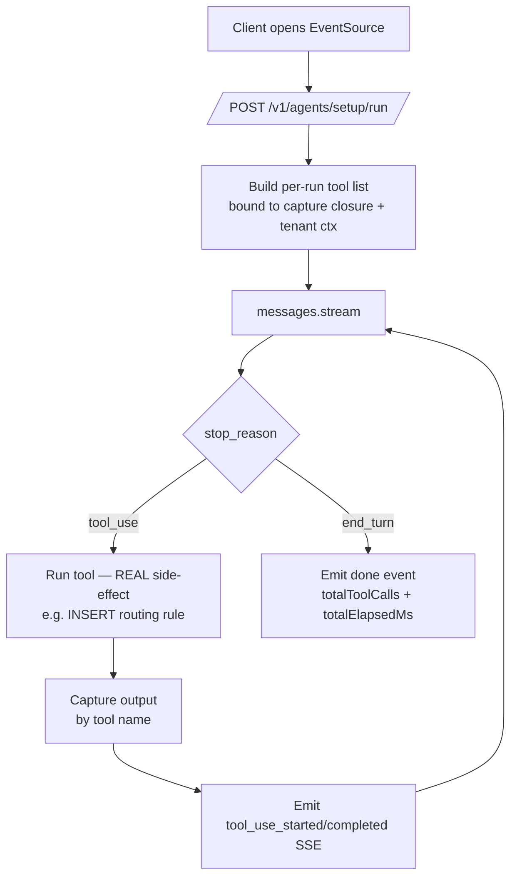
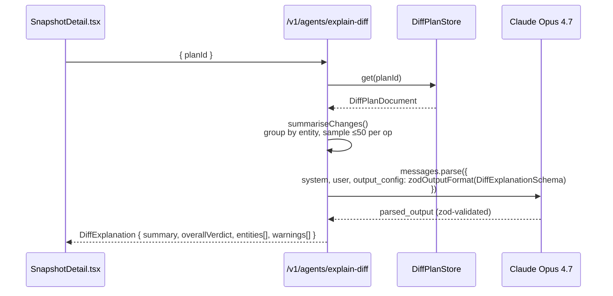

# `api/src/agents/`

Three Claude-powered agents that drive Vastify's headline AI features. Each agent is mounted under `/v1/agents/*` by [`server.ts`](../server.ts) and shares one Anthropic client (`shared/client.ts`) running on **Claude Opus 4.7** (`claude-opus-4-7`).

| Agent | Surface | Style |
|---|---|---|
| [`setup/`](setup) | `POST /v1/agents/setup/run` (SSE) | Autonomous tool loop · 6 zod-typed tools · streams events to UI |
| [`diff-explainer/`](diff-explainer) | `POST /v1/agents/explain-diff` (JSON) | Single-turn structured output · `messages.parse` + zod schema |

## Setup Agent — autonomous tool loop



**Six tools, each with a real local side-effect where feasible** (the project rule is "real over mocked"):

| Tool | Side-effect |
|---|---|
| `inspect_org` | (mocked — no live SF in demo) Returns object/storage shape |
| `pick_backend` | (mocked) Returns `gcs us-central1 STANDARD` |
| `write_storage_config` | **Real:** writes to `tenants.storage_config_json` |
| `generate_starter_rules` | **Real:** INSERTs 4 rules with `_source: "setup-agent"` marker so re-runs replace prior agent output without disturbing user-edited rules |
| `deploy_sf_package` | (mocked) Returns success summary |
| `validate_connection` | **Real:** HTTP-pings the local OData endpoint |

The capture closure is rebuilt per run so concurrent agent invocations never see each other's tool outputs.

## Diff Explainer — structured output



The model sees a Markdown-rendered breakdown with up to 50 sample records per operation per entity — keeps the prompt under control on multi-thousand-row diffs while preserving enough field-level evidence to classify risk.

Output schema lives in [`diff-explainer/explainer.ts`](diff-explainer/explainer.ts):

```ts
type DiffExplanation = {
  summary: string;
  overallVerdict: 'safe' | 'review' | 'skip';
  entities: Array<{
    objectName: string;
    verdict: 'safe' | 'review' | 'skip';
    reasoning: string;
    insertCount: number;
    updateCount: number;
    skipDeleteCount: number;
  }>;
  warnings: string[];
};
```

## Configuration

| Env var | Purpose |
|---|---|
| `ANTHROPIC_API_KEY` | Required — both agents fail fast on first call without it |
| `ANTHROPIC_MODEL` | Optional override; default `claude-opus-4-7` |

## Why these two agents

- **Setup Agent demonstrates *tool use*** — autonomous multi-step loop with real DB side-effects, surfaced as a live transcript in the UI.
- **Diff Explainer demonstrates *analytical reasoning over real data*** — Claude reads a real backup change-set and produces per-object verdicts.

Two distinct Opus capabilities — reads as creative integration rather than "we glued an LLM to one button."
