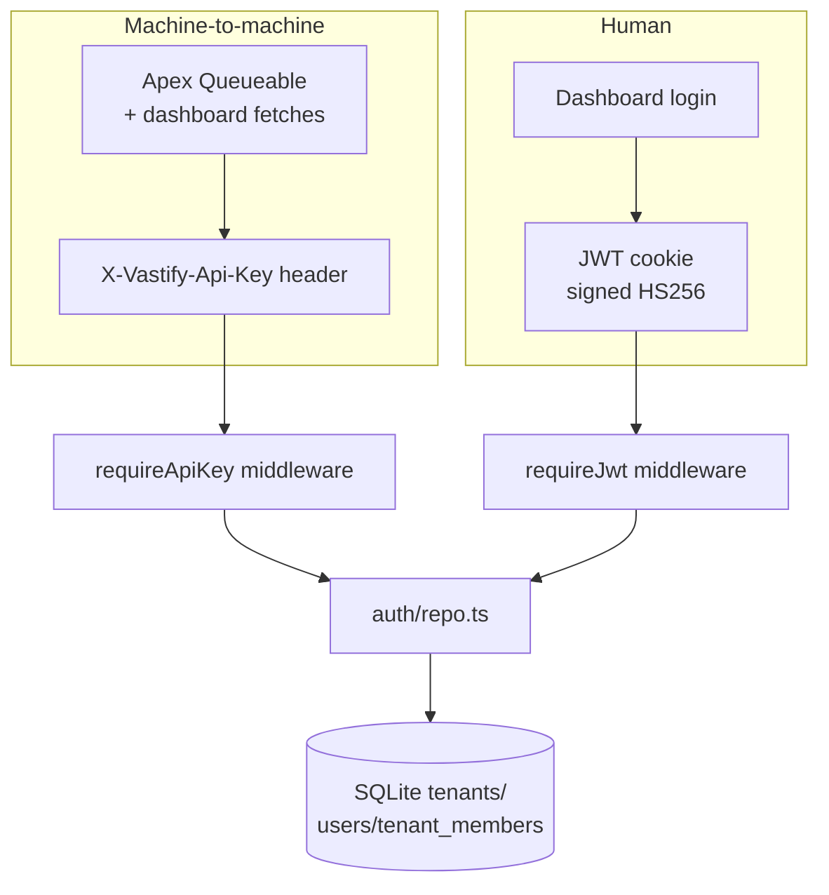

# `api/src/auth/`

Two layers, one DB.

## Why two layers

- **API keys** authenticate other systems — Apex callouts and the dashboard's anonymous demo mode. One key per tenant, hashed at rest.
- **JWTs** authenticate humans. The dashboard logs a user into a tenant; the JWT carries `sub`, `tenantId`, `role`. Tenant-membership is stored separately in `tenant_members` so a user can belong to multiple tenants.

## Demo OData bypass

Set `VASTIFY_DEMO_PUBLIC_ODATA=true` and `requireApiKey` falls back to the demo tenant on `/odata/v1/*` requests with no key. **Demo only** — wiring per-user Named Credentials through Salesforce Connect's External Credentials is out of scope for the hackathon, but the intentional shortcut is gated to that one path and one env var.

## Files

| File | Purpose |
|---|---|
| [`api-key.ts`](api-key.ts) | `requireApiKey` middleware + `tenantOf(c)` helper; demo-mode fallback lives here |
| [`jwt.ts`](jwt.ts) | `signJwt`, `verifyJwt` — HS256, short TTL, refresh path |
| [`repo.ts`](repo.ts) | DB CRUD: tenants, users, tenant_members, tenant_invites |
| [`routes.ts`](routes.ts) | Login / register / accept-invite / refresh-token endpoints |

## Tests

| Test | Covers |
|---|---|
| [`test/jwt.test.ts`](test/jwt.test.ts) | Sign/verify round-trip, expiry, tampered signature |
| [`test/middleware.test.ts`](test/middleware.test.ts) | Header parsing, demo bypass, tenant lookup |
| [`test/auth-routes.test.ts`](test/auth-routes.test.ts) | Login, register, invite-accept end-to-end |
