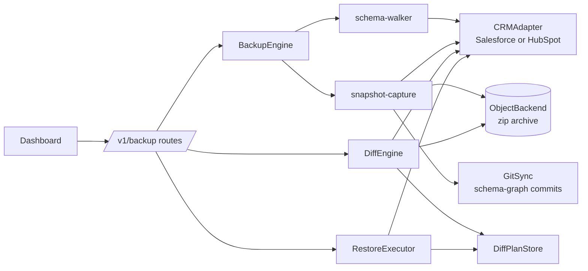
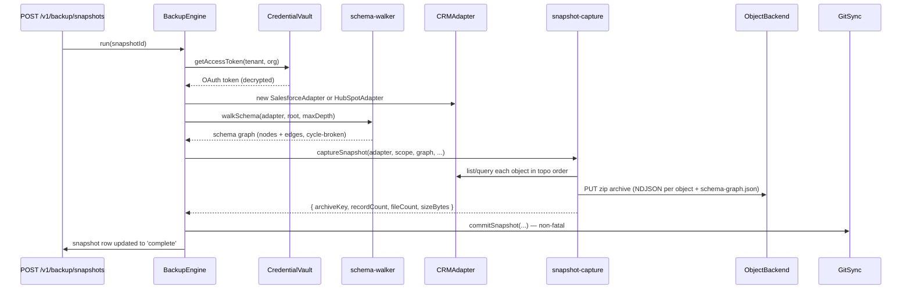
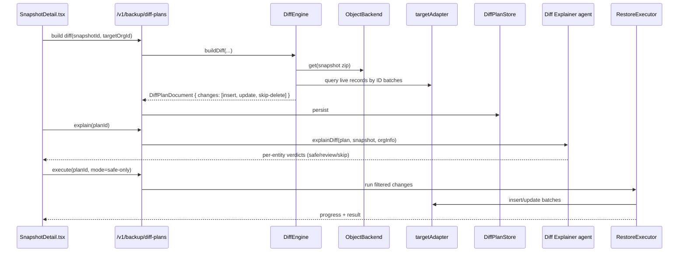

# `api/src/backup/`

Snapshot, diff, and restore of an entire CRM org. Built around an adapter interface so the same engine works against Salesforce or HubSpot.

## Subsystems

### Snapshot capture (`backup-engine.ts` + `snapshot-capture.ts` + `schema-walker.ts`)

### Diff + restore (`diff-engine.ts` + `restore-executor.ts`)

### Credential vault

`credential-vault.ts` encrypts OAuth tokens at rest with a per-tenant master key. The vault is the only thing in the API that ever sees a plaintext access token; backend adapters get them through a `getAccessToken()` callback so tokens never live on instance fields.

### Git sync

`git-sync.ts` writes a human-readable `schema-graph.json` to a per-tenant git repo on every snapshot. This isn't the data backup — that's the zip in object storage — it's a diffable history of *schema shape* over time, useful for "what changed in our CRM model this quarter?"

## File map

| File | Purpose |
|---|---|
| `backup-engine.ts` | Orchestrates snapshot run end-to-end |
| `snapshot-capture.ts` | Streams CRM records into a zip archive (NDJSON per object) |
| `schema-walker.ts` | BFS the CRM schema from a root object, breaking cycles |
| `diff-engine.ts` | Compares snapshot vs live org → `DiffPlanDocument` |
| `diff-plan-store.ts` | Persists diff plans (object storage + SQLite metadata) |
| `restore-executor.ts` | Applies a diff plan with mode filter (`all` / `safe-only` / `dry-run`) |
| `credential-vault.ts` | AES-GCM seal/open of OAuth tokens |
| `git-sync.ts` | Per-tenant `simple-git` repo for schema history |
| `crm/types.ts` | `CRMAdapter` interface — list, query, insert, update batches |
| `crm/salesforce-adapter.ts` | jsforce-backed implementation |
| `crm/hubspot-adapter.ts` | HubSpot REST implementation |
| `repo.ts` | SQLite repos: `connectedOrgs`, `backupScopes`, `snapshots`, `restoreJobs`, `diffPlans` |
| `routes.ts` | All `/v1/backup/*` REST endpoints |
| `errors.ts` | Typed error classes |
| `types.ts`, `diff-types.ts` | Shared types |

## Tests

10 test files under [`test/`](test/) cover engine, vault, diff engine, plan store, git sync, both adapters, repo, restore executor, schema walker, and snapshot capture.
