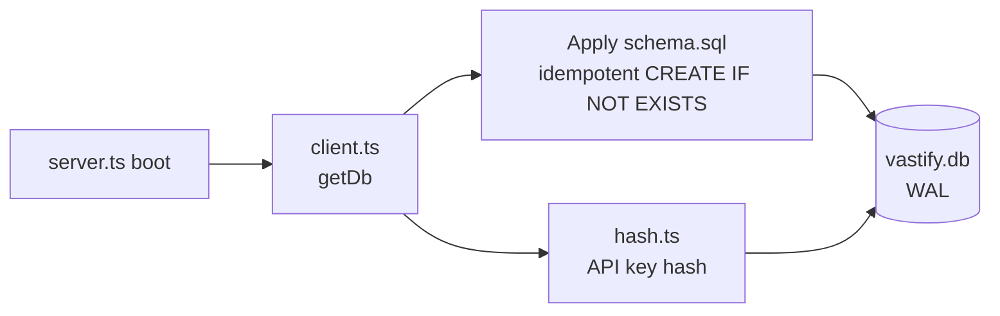

# `api/src/db/`

Single SQLite database via `bun:sqlite`. Lives at the path `loadConfig().dbPath` (default `api/vastify.db`). WAL mode, foreign keys on.

## Why SQLite

- Zero infra — same `bun:sqlite` is on `localhost`, in CI, and in the demo container
- Fast enough for ~100k records per tenant (the bottleneck is then bucket reads, not the index)
- Rebuildable: every row in here can be reconstructed by listing object storage and re-parsing JSON bodies
- Dev-time simplicity: copy `vastify.db` to a colleague to debug their state

For enterprise scale this swaps out without changing application code: same query shapes work against Postgres or DuckDB-over-Parquet.

## Tables

See [`schema.sql`](schema.sql) for full column list and indexes. Tables:

| Table | Purpose | Source of truth? |
|---|---|---|
| `tenants` | Tenant identity + API-key hash | Yes (config) |
| `files` | File metadata (one row per upload) | No — bucket is |
| `records_index` | Denormalised columns for OData `$filter` | No — bucket is |
| `rules` | Routing rules | Yes |
| `events` | Audit/event log used by SSE stream | Yes |
| `savings_snapshots` | Periodic point-in-time savings totals | Yes |
| `users`, `tenant_members`, `tenant_invites` | Human auth (see [`../auth/`](../auth/)) | Yes |
| `connected_orgs`, `backup_scopes`, `snapshots`, `restore_jobs`, `diff_plans` | Backup subsystem (see [`../backup/`](../backup/)) | No — bucket is for the data, yes for metadata |

## Files

| File | Purpose |
|---|---|
| [`schema.sql`](schema.sql) | Full DDL applied on every boot |
| [`client.ts`](client.ts) | `getDb()` singleton + schema-apply on first call |
| [`hash.ts`](hash.ts) | Constant-time SHA-256 hash for API keys before insert/compare |
