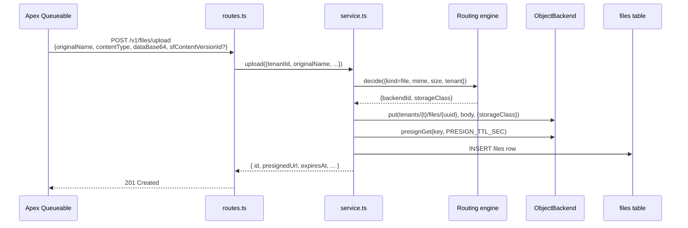

# `api/src/files/`

File upload, list, refresh-presigned-URL, delete. The Salesforce side calls these endpoints from `FileOffloadQueueable`.

## Endpoints (`/v1/files`)

| Method | Path | Purpose |
|---|---|---|
| `POST` | `/upload` | Upload a file; routing engine picks backend + class; presigned URL minted |
| `GET` | `/:id` | File metadata row |
| `GET` | `/:id/refresh` | Mint a fresh presigned URL (old one expired) |
| `GET` | `/` | List, paged |
| `DELETE` | `/:id` | Delete row + backend object |

## Why `dataBase64` and not multipart?

Apex's `Http.send()` POST body is a `String` — multipart support is gnarly enough in Apex that base64 in JSON is the path of least resistance. The `dataBase64` field is decoded once on entry.

For a v2, direct browser-to-cloud presigned `PUT` URLs would remove the Apex heap ceiling (currently ~6 MB) and skip this hop entirely.

## Files

| File | Purpose |
|---|---|
| [`service.ts`](service.ts) | Pure-ish business logic — upload, list, refresh, delete |
| [`routes.ts`](routes.ts) | Hono routes + API-key middleware + zod validation |
