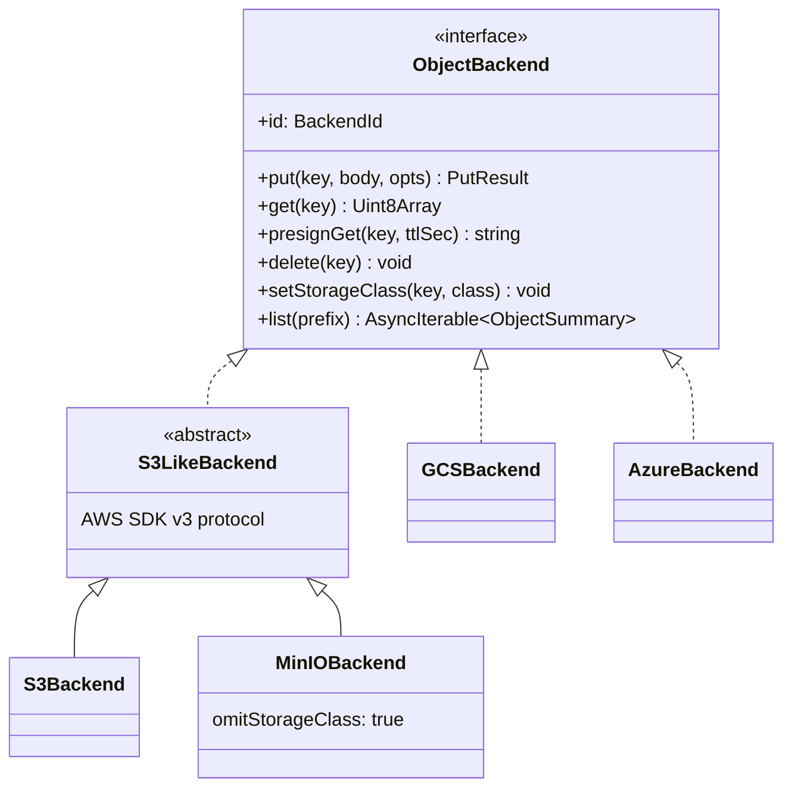

# `api/src/object/`

One interface, four backend implementations. Every byte Vastify writes — files and record JSON — flows through this module.



`StorageClass` is canonicalised on GCS names: `STANDARD | NEARLINE | COLDLINE | ARCHIVE`. Each backend translates these to its own native class names.

## Key layout

`tenantKey(tenantId, ...parts)` builds:

```
tenants/{tenantId}/files/{fileId}
tenants/{tenantId}/records/{entity}/{pk}.json
```

Identical across S3, GCS, Azure, MinIO/R2 — so cross-cloud migration is one-backend-to-one-backend `list → get → put`.

## Files

| File | Purpose |
|---|---|
| [`backend.ts`](backend.ts) | The `ObjectBackend` interface, types, `tenantKey()` helper |
| [`s3-like.ts`](s3-like.ts) | Shared base for AWS S3 and MinIO (both speak AWS SDK v3) |
| [`s3.ts`](s3.ts) | AWS S3 — SSE, intelligent-tiering, IAM auth |
| [`minio.ts`](minio.ts) | MinIO — same base, `omitStorageClass: true` (default config rejects non-`STANDARD`) |
| [`gcs.ts`](gcs.ts) | Google Cloud Storage — uses `@google-cloud/storage`, presigned V4 |
| [`azure.ts`](azure.ts) | Azure Blob — uses `@azure/storage-blob`, SAS URLs |
| [`registry.ts`](registry.ts) | Reads env config, instantiates enabled backends, exposes a `Map<BackendId, ObjectBackend>` to the rest of the app |

## Contract test

Every implementation must pass [`api/test/object-backend.test.ts`](../../test/object-backend.test.ts) — the same suite, parameterised over backend. Tests cover round-trip put/get, presigned URL, list-by-prefix, delete-then-get-404, storage-class set, and prefix isolation.

In CI we run the suite against MinIO (via `docker-compose`); the same tests pass live against S3, GCS, and Azure when their credentials are set.

## Why one interface, not adapters per cloud

- **Same key layout everywhere** = the SQLite index is portable
- **Same observable behaviour** (verified by contract test) = the routing engine treats all backends identically
- **Adding a backend** = one new file + add to `registry.ts` + run the contract test
