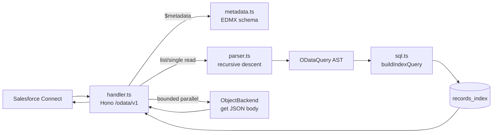
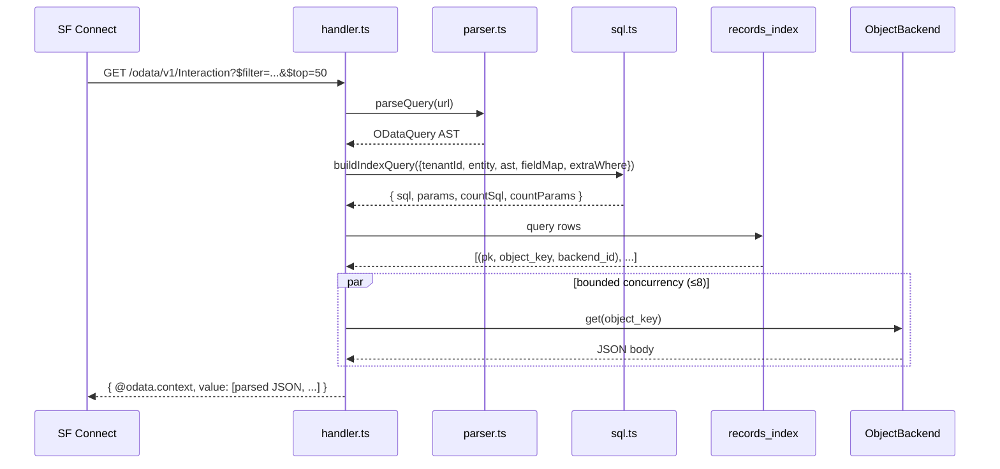

# `api/src/odata/`

OData 4.0 server that Salesforce Connect speaks to. Two External Objects (`Vastify_Interaction__x` and `ArchivedInteraction__x`) are served from the same `/odata/v1/*` mount.



## Files

| File | Purpose |
|---|---|
| [`parser.ts`](parser.ts) | Hand-written recursive-descent parser for `$filter` + tokenizer; also parses `$orderby`, `$top`, `$skip`, `$select`, `$count` |
| [`sql.ts`](sql.ts) | AST → parameterised SQL `WHERE` against `records_index`; field allowlist (raises `UnindexedFieldError` on unindexed fields) |
| [`handler.ts`](handler.ts) | HTTP routes — service doc, `$metadata`, list, single, POST/PATCH/DELETE |
| [`metadata.ts`](metadata.ts) | EDMX XML for both entity sets — read once at startup |
| [`types.ts`](types.ts) | `FilterExpr`, `FilterLiteral`, `ODataQuery` AST types |

## Read sequence



## Field allowlist

`$filter` and `$orderby` only reach columns denormalised onto `records_index`. Asking for an unindexed field raises `UnindexedFieldError` → HTTP 501.

```ts
INTERACTION_FIELD_MAP = {
  Timestamp: 'timestamp',
  Channel: 'channel',
  Type: 'type',
  AccountId: 'account_id',
  ContactId: 'contact_id',
  Subject: 'subject',
  IsArchived: 'is_archived',
};
```

To add a filterable field: add a column to `records_index`, backfill from JSON objects in the bucket, extend this map.

## Why two entities, one mount

`Vastify_Interaction__x` is read/write; `ArchivedInteraction__x` is read-only. The handler enforces this with:

- An extra `WHERE is_archived = 1` clause on `ArchivedInteraction` reads
- `POST/PATCH/DELETE` on `ArchivedInteraction` returns 405

The two External Object types exist mainly to give Archived Records its own App Launcher tab — same backing storage, different SF UI affordances.

## Demo auth shortcut

Set `VASTIFY_DEMO_PUBLIC_ODATA=true` to skip the API-key check on `/odata/v1/*` and fall back to the demo tenant. **Demo only.** Production should wire Salesforce Named Credential + External Credential through `requireApiKey`.

## Tests

[`api/test/odata-parser.test.ts`](../../test/odata-parser.test.ts) covers tokenizer edge cases, comparison ops, boolean precedence (`and` binds tighter than `or`), parens, datetime parsing, and `$top/$skip/$select/$count`.

[`api/test/odata-sql.test.ts`](../../test/odata-sql.test.ts) covers the AST → SQL translator: literal binding, NULL handling, `UnindexedFieldError`, ORDER BY mapping, default and capped `$top`, and tenant/entity scope.
