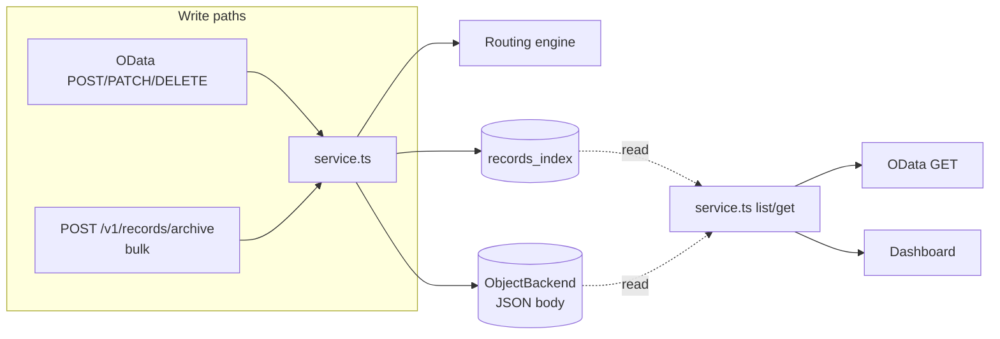
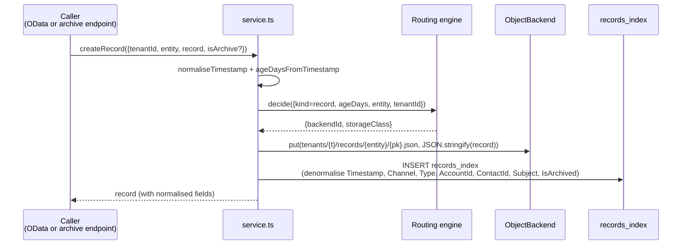
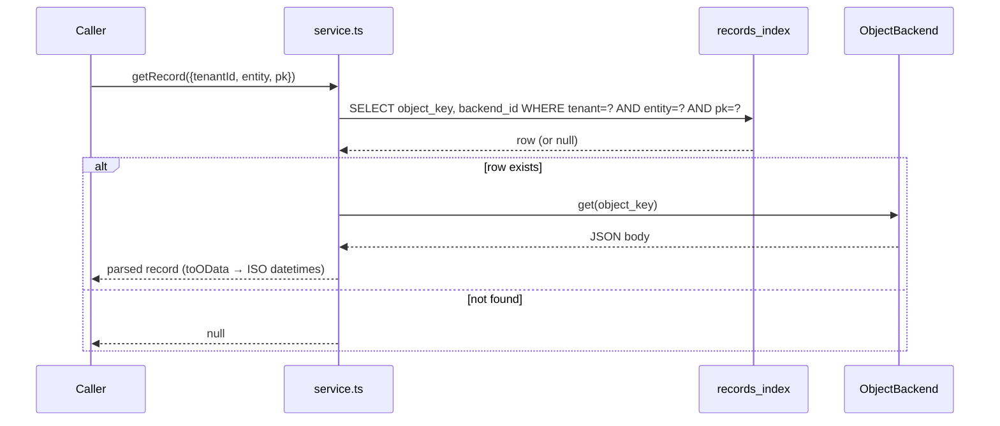

# `api/src/records/`

CRUD over the SQLite `records_index` + the JSON-per-record blobs in object storage. Used by both:

- The OData adapter (read path — the handler in [`../odata/`](../odata/) calls into here)
- The dashboard's "Records" page (live + archived list views)
- The Apex archiver (`POST /v1/records/archive` bulk path)



## Storage shape

Each record is **one JSON object per record** at:

```
tenants/{tenantId}/records/{entity}/{pk}.json
```

The SQLite `records_index` carries denormalised filter columns (timestamp, channel, type, account_id, contact_id, subject, is_archived) so OData `$filter` and `$orderby` can be answered without reading every blob.

This index is a **cache, not source of truth** — losing it just means re-listing the bucket and re-parsing the JSONs.

## Write flow



## Read flow (single record)



## Why JSON-per-record vs columnar?

- One object family means one IAM story, one backup policy, one cross-cloud copy
- The index is rebuildable from the bucket → bucket is source of truth
- Column-level filtering still works — denormalise into the index columns
- For >100k records per tenant, swap the SQLite index for DuckDB-over-Parquet without touching the bucket

## Files

| File | Purpose |
|---|---|
| [`service.ts`](service.ts) | `createRecord`, `getRecord`, `updateRecord`, `deleteRecord`, `listRecords` (OData query passthrough) |
| [`routes.ts`](routes.ts) | `/v1/records/*` REST surface — used by dashboard and `archive` bulk path |

The OData mount lives separately in [`../odata/handler.ts`](../odata/handler.ts) and calls into this service for record I/O.
