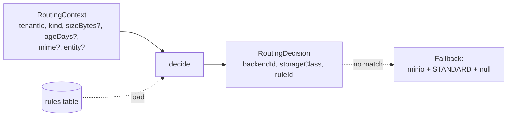
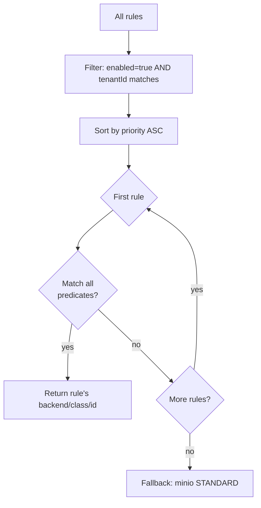

# `api/src/routing/`

Pure-function rule engine. Decides *which backend* and *which storage class* every new file or record lands in.

`decide(ctx, rules)` is **pure** — same input, same output, no I/O. The DB load happens once per request in the calling route handler.

## Algorithm

Predicates evaluated by `matches()`:

| Field | Semantics |
|---|---|
| `kind` | Exact match — `file` or `record` |
| `sizeBytesMin` / `sizeBytesMax` | Inclusive bounds; missing `sizeBytes` treated as `0` |
| `ageDaysMin` / `ageDaysMax` | Inclusive bounds; missing `ageDays` treated as `0` (min) or `+∞` (max) |
| `mimeRegex` | RegExp test — fails if context has no `mime` |
| `entity` | Exact match — file rules can omit; record rules typically pin to `Interaction` |

## Files

| File | Purpose |
|---|---|
| [`engine.ts`](engine.ts) | `decide()` + `explainDecision()` (returns per-rule match results, used by `/v1/rules/preview`) |
| [`rules.ts`](rules.ts) | DB CRUD wrappers — load/save/update/delete rule rows |
| [`types.ts`](types.ts) | `RoutingRule`, `RoutingContext`, `RoutingDecision`, `MatchPredicate`, `Target` |

## Default seeded rules

Seed runs through [`scripts/seed.ts`](../scripts/seed.ts):

| Priority | Match | Target |
|---|---|---|
| 10 | `kind=file`, `mime^=image/` | `gcs` STANDARD |
| 20 | `kind=file`, `size≥10 MB` | `gcs` COLDLINE |
| 30 | `kind=file` | `gcs` STANDARD |
| 40 | `kind=record`, `age≥90d` | `gcs` ARCHIVE |
| 50 | `kind=record` | `gcs` STANDARD |

The Setup Agent's `generate_starter_rules` tool seeds a similar set with `_source: "setup-agent"` in `match_json` so re-runs replace its own rules without disturbing user-edited ones.

## Tests

[`api/test/routing.test.ts`](../../test/routing.test.ts) covers fallback, priority, disabled rules, tenant isolation, mime regex, size bounds, age bounds, entity matching, and `explainDecision()`.
