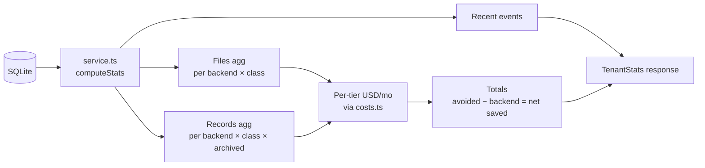

# `api/src/stats/`

The "savings narrative" math. Powers the dashboard's net-savings ticker, storage-class donut, and per-backend cost bars — and the SSE event stream that pushes live updates.



## Cost math

```
sf_avoided_$  = file_bytes / 10⁹ × $5         + record_bytes / 10⁹ × $250
backend_$     = Σ tier (bytes_in_tier / 10⁹ × $_per_gb_per_month)
net_savings_$ = sf_avoided_$ − backend_$
```

Salesforce list-price constants live in [`costs.ts`](costs.ts):

| Constant | Value | Source |
|---|---|---|
| `SF_DATA_USD_PER_GB_MONTH` | 250 | SF Winter '25 additional-capacity tier |
| `SF_FILE_USD_PER_GB_MONTH` | 5 | SF Winter '25 additional-capacity tier |
| `BACKEND_COSTS.gcs.STANDARD` | 0.020 | GCS us-central1 published rate |
| `BACKEND_COSTS.s3.STANDARD` | 0.023 | S3 us-east-1 published rate |
| `BACKEND_COSTS.azure.STANDARD` | 0.0184 | Azure Hot LRS published rate |
| `BACKEND_COSTS.minio.*` | 0 | Self-hosted — no $/GB applies |

Cold tiers (`NEARLINE`, `COLDLINE`, `ARCHIVE`) carry the same canonical class names everywhere; per-backend numbers map to that backend's native tier names (S3 Standard-IA / Glacier IR / Deep Archive, Azure Cool / Cold / Archive, etc.).

## Records: estimated bytes

Records are stored as JSON objects. We don't know each one's exact size without reading it, so `computeStats` uses a **400 byte average** (typical Interaction shape) and multiplies by the index row count:

```ts
const AVG_RECORD_BYTES = 400;
const approxBytes = r.cnt * AVG_RECORD_BYTES;
```

This is honest enough for the dashboard — the math is dominated by the file side anyway.

## SSE event stream

`routes.ts` mounts `GET /v1/stats/events`. The dashboard's [`useStatsStream`](../../../dashboard/src/hooks/useStatsStream.ts) polls `/v1/stats` every 3s (not SSE — `EventSource` can't set custom auth headers in the browser). The event stream feeds the recent-activity list.

## Files

| File | Purpose |
|---|---|
| [`costs.ts`](costs.ts) | Pure constants + `costPerGbMonth(backendId, class)` lookup |
| [`service.ts`](service.ts) | `computeStats(tenantId)` — single-query-per-aggregation, no allocations beyond the response |
| [`routes.ts`](routes.ts) | `GET /v1/stats`, `GET /v1/stats/events` (SSE) |

## Tests

[`api/test/stats-costs.test.ts`](../../test/stats-costs.test.ts) covers the pure cost lookup: backend coverage, unknown backends/classes returning 0, and tier ordering invariants.
