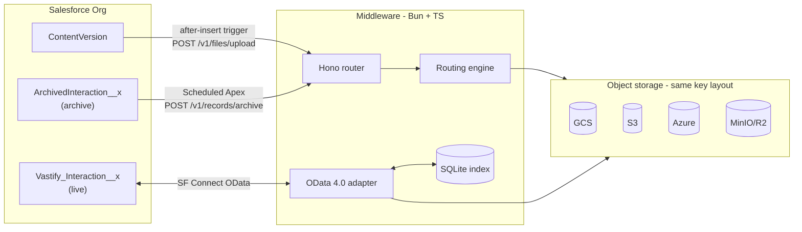
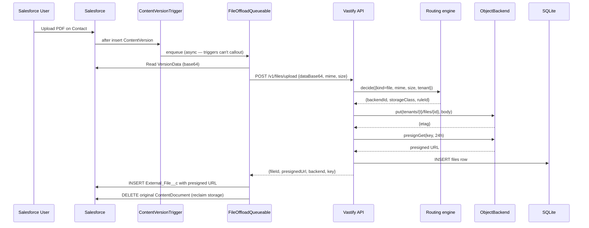
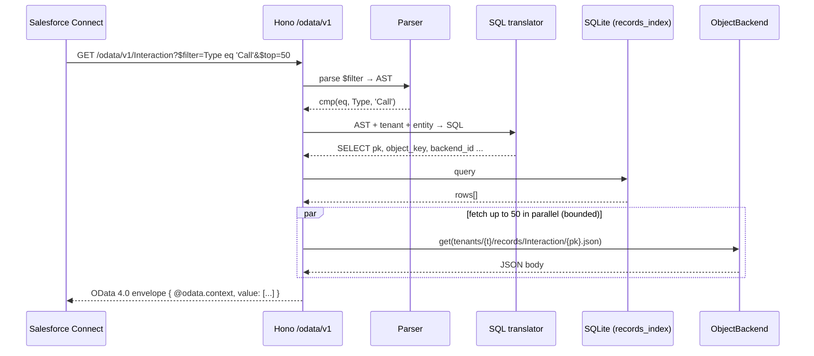
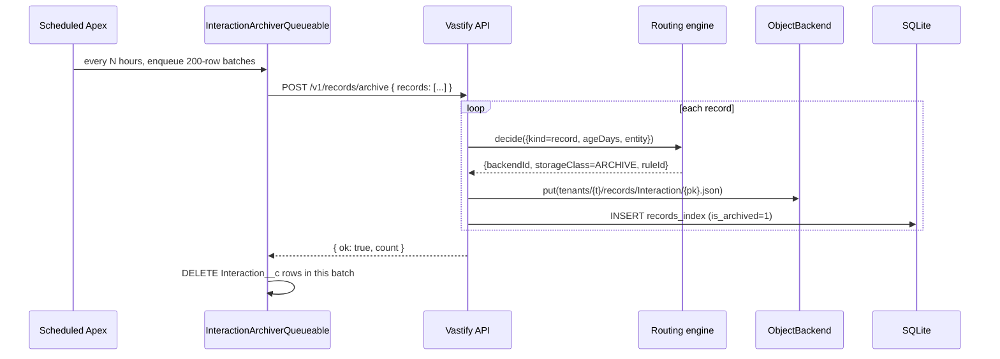
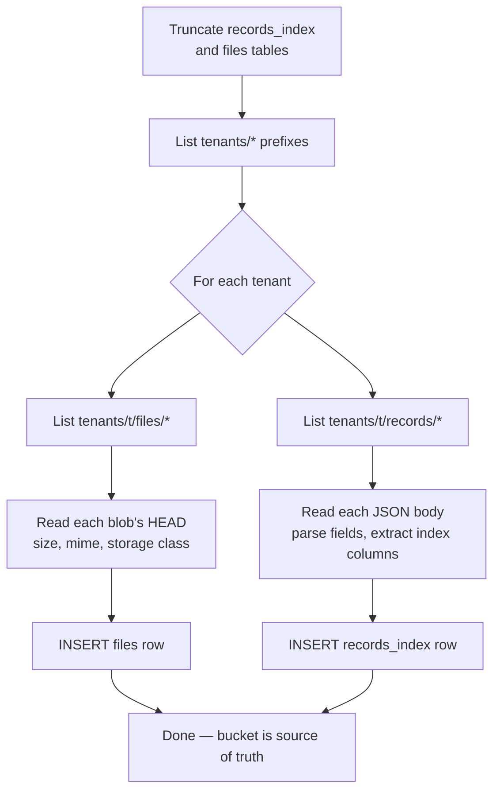
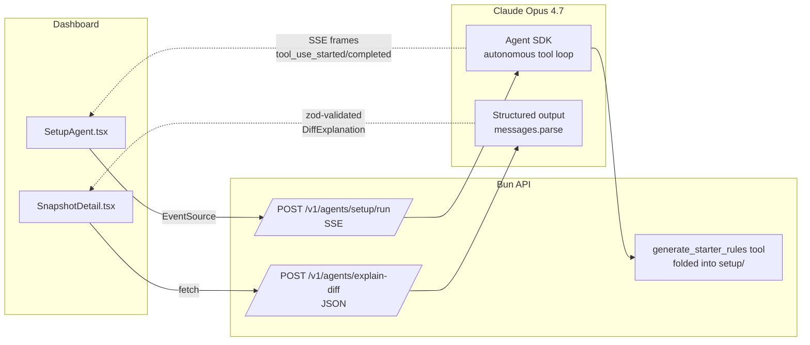
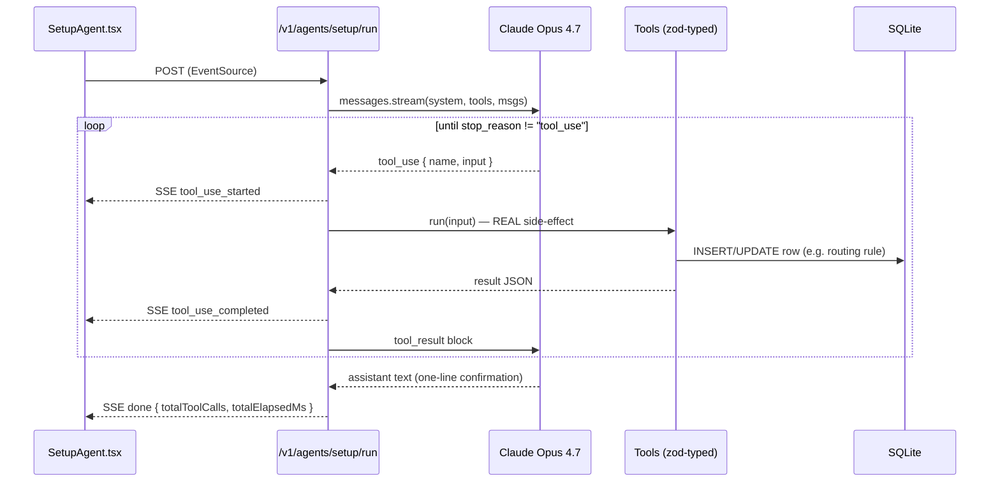

# Architecture

This document describes the design of Vastify: why the pieces are shaped the way they are, what tradeoffs we made, and where the boundaries are.

## Problem

Salesforce charges punishing markups for storage at scale:

| Tier | Salesforce list price | Commodity object storage |
|---|---|---|
| Data (record rows) | ~$250 / GB / month | ~$0.02 / GB / month (GCS Standard) |
| Files (attachments) | ~$5 / GB / month | ~$0.02 / GB / month |

A large enterprise Salesforce org can spend six figures a year on storage that could live on its own AWS / GCP / Azure account at a fraction of the cost. Vastify's job is to move those bytes onto commodity storage while keeping the Salesforce UX intact — users continue to search, filter, edit, and link records without knowing anything changed.

## Three pipelines, one storage layout



Every byte in object storage, regardless of cloud, lives at the same prefix:

```
tenants/{tenantId}/
  files/{fileId}                                    ← binary blob
  records/{entity}/{pk}.json                        ← one record per object
```

This uniform layout means a disaster-recovery reconciler can rebuild the entire SQLite index by listing and reading objects, and a cross-cloud migration is a one-backend-to-one-backend copy.

### File upload sequence



### OData read sequence (Salesforce list view)



### Record archive sequence



## Why object storage for records, not a database?

The obvious design for "offload Salesforce records" is a relational store (Postgres, Aurora). We considered it; we went the other way. Reasons:

- **One storage family.** Files already had to live on object storage. Using the same for records means one SDK, one IAM story, one bucket per tenant, one backup policy.
- **Durability and cost.** S3 / GCS are eleven-nines durable and cheaper per byte than any managed SQL service. Records rarely need the features of SQL (joins, transactions) once they've left the primary system.
- **Storage-class tiering is native.** Old records move to Coldline / Archive tiers via a single API call — no separate "hot/cold" database split.

The tradeoff is that object storage is key-value, not queryable. Salesforce External Objects need `$filter`, `$orderby`, `$top`, `$skip` — so we added a SQLite index that denormalises the filterable fields. The index is a *cache* of what's in the bucket, not the source of truth:

- Lose the index → rebuild it by listing the bucket and parsing each JSON object.
- Corrupt the index → truncate and re-index from the bucket.
- Scale the index → SQLite handles ~100k records per tenant comfortably; DuckDB-over-Parquet or Postgres are drop-in swaps for enterprise scale.

## The `ObjectBackend` interface

One interface, four implementations:

```ts
export interface ObjectBackend {
  readonly id: 's3' | 'gcs' | 'azure' | 'minio';

  put(key: string, body: Uint8Array, opts?: PutOptions): Promise<PutResult>;
  get(key: string): Promise<Uint8Array>;
  presignGet(key: string, ttlSec: number): Promise<string>;
  delete(key: string): Promise<void>;
  setStorageClass(key: string, storageClass: StorageClass): Promise<void>;
  list(prefix: string): AsyncIterable<ObjectSummary>;
}
```

`StorageClass` is canonicalised on GCS names (`STANDARD`, `NEARLINE`, `COLDLINE`, `ARCHIVE`); each backend maps to its native names. S3 and MinIO share an `S3LikeBackend` base since both speak the AWS SDK v3 protocol.

All four implementations are contract-tested against the same test suite (`api/test/object-backend.test.ts`) — every backend must satisfy the same observable behaviour.

## Routing engine

New objects — both files and records — flow through a pure-function rule evaluator:

```ts
decide(
  { tenantId, kind, sizeBytes?, ageDays?, mime?, entity? }: RoutingContext,
  rules: RoutingRule[]
): { backendId, storageClass, ruleId }
```

Rules are evaluated by ascending `priority`; first match wins. No rules → fallback (`minio` / `STANDARD`). Rules are persisted in SQLite and editable live through `/v1/rules`.

Typical seeded rule set:

| Priority | Match | Target |
|---|---|---|
| 10 | `kind=file`, `mime^=image/` | `gcs` Standard |
| 20 | `kind=file`, `size≥10 MB` | `gcs` Coldline |
| 30 | `kind=file` | `gcs` Standard |
| 40 | `kind=record`, `age≥90d` | `gcs` Archive |
| 50 | `kind=record` | `gcs` Standard |

Two extensions we designed for but didn't ship:

- **Hot→cold rebalance job** — scans the index for records whose `ageDays` now crosses a rule threshold and calls `setStorageClass` on each.
- **Cost-aware strategies** — picking the cheapest cloud per object given user-declared latency SLAs.

## OData adapter

Salesforce Connect speaks OData 2.0 or 4.0. We picked 4.0 because it's the newer protocol and Agentforce prefers it.

### Parser

Hand-written recursive-descent parser for the `$filter` grammar (`api/src/odata/parser.ts`). It supports:

- Comparison operators: `eq`, `ne`, `gt`, `lt`, `ge`, `le`
- Logical combinators: `and`, `or`, `not`
- Grouping with parentheses
- Literals: string (`'foo'` with `''` escape), number, bool, null, datetime

Plus `$orderby`, `$top`, `$skip`, `$select`, `$count`. 17 unit tests cover edge cases including operator precedence (`and` binds tighter than `or`) and datetime parsing.

### SQL translator

`api/src/odata/sql.ts` converts an OData AST to a parameterised SQL `WHERE` clause against `records_index`. It enforces a field allowlist: `$filter` against an unindexed field throws `UnindexedFieldError`, which the handler surfaces as HTTP 501.

The "allowlist" is the denormalised columns on `records_index` — to add a filterable field you add a column, backfill from the JSON objects, and extend the field-map.

### Handler

`api/src/odata/handler.ts` mounts at `/odata/v1/*` and exposes:

- `GET /` — service document
- `GET /$metadata` — EDMX schema for both entity sets
- `GET /:entity(key?)` — list or single-record read
- `POST /:entity` — create (writable Interactions only)
- `PATCH/PUT /:entity(key)` — update
- `DELETE /:entity(key)` — delete

Read flow:
1. Parse URL → `ODataQuery` AST
2. Translate filter/orderby → SQL against `records_index`
3. Paged `(pk, object_key, backend_id)` rows come back
4. Parallel-fetch the JSON objects from the named backend (bounded concurrency)
5. Assemble OData 4.0 envelope and return

`ArchivedInteraction` is read-only — a hard-coded additional `WHERE is_archived = 1` clause filters out live rows, and `POST/PATCH/DELETE` return 405.

## Salesforce package

### File offload

`after insert` trigger on `ContentVersion` enqueues `FileOffloadQueueable` (`Queueable, Database.AllowsCallouts`). The queueable:

1. Reads `VersionData` and base64-encodes.
2. `POST /v1/files/upload` with `{ originalName, contentType, sfContentVersionId, dataBase64 }`.
3. Inserts an `External_File__c` row with the returned presigned URL, backend, size, object key.
4. Optionally deletes the `ContentDocument` to reclaim storage (`Delete_Original_ContentVersion__c` on the custom metadata type).

The async path is necessary because Apex triggers cannot make synchronous callouts.

### Record archive

`InteractionArchiverSchedulable` (`Schedulable`) queries `Interaction__c` older than `Archive_Age_Days__c` (default 90), splits into 200-row batches, and enqueues `InteractionArchiverQueueable` per batch. Each queueable:

1. Builds a `records` array mirroring our OData shape.
2. `POST /v1/records/archive` — middleware bulk-inserts with `IsArchived=true` and tier `ARCHIVE` (per the default routing rules).
3. Deletes the native rows on success.

### Live External Objects

`Vastify_Interaction__x` and `ArchivedInteraction__x` are both created from the `Vastify_OData` External Data Source via **Validate and Sync**. Salesforce Connect handles the wire protocol; our middleware only has to be a correct OData 4.0 server.

## Dashboard

React + Vite + Tailwind + Recharts. The interesting piece is `useStatsStream` (`dashboard/src/hooks/useStatsStream.ts`): it polls `/v1/stats` every 3 seconds because `EventSource` (SSE) cannot set custom auth headers in the browser. A WebSocket or a cookie-based API key would move this to true push updates; polling was fine for hackathon pace.

Savings math (`api/src/stats/service.ts`):

```
sf_avoided_$  = (file_bytes / 10^9) * $5   +  (record_bytes / 10^9) * $250
backend_$     = Σ (bytes_in_class / 10^9) * $_per_gb_per_month(class, backend)
net_savings_$ = sf_avoided_$ - backend_$
```

Backend per-GB constants live in `api/src/stats/costs.ts`.

## What's in SQLite

```mermaid
erDiagram
    tenants ||--o{ files : owns
    tenants ||--o{ records_index : owns
    tenants ||--o{ rules : owns
    tenants ||--o{ events : owns
    tenants ||--o{ savings_snapshots : owns

    tenants {
        text id PK
        text name
        text api_key_hash
        int  created_at
    }
    files {
        text id PK
        text tenant_id FK
        text sf_content_version_id
        text original_name
        text backend_id
        text storage_class
        text object_key
        int  size_bytes
        text mime_type
        int  created_at
    }
    records_index {
        text tenant_id FK
        text entity
        text pk PK
        text backend_id
        text storage_class
        text object_key
        int  timestamp
        text channel
        text type
        text account_id
        text contact_id
        text subject
        int  is_archived
        int  created_at
    }
    rules {
        text id PK
        text tenant_id FK
        int  priority
        text match_json
        text target_json
        int  enabled
        int  created_at
    }
    events {
        text id PK
        text tenant_id FK
        text kind
        text payload_json
        int  created_at
    }
    savings_snapshots {
        text id PK
        text tenant_id FK
        int  at
        int  sf_data_bytes_avoided
        int  sf_file_bytes_avoided
        text backend_bytes_by_class_json
        real usd_saved_monthly_estimate
    }
```

Indexes on `(tenant_id, entity, timestamp DESC)`, `(tenant_id, is_archived, timestamp DESC)`, `(tenant_id, entity, account_id)`, etc. keep list-view queries sub-10ms up to ~100k records per tenant.

### Index rebuild from object storage

The SQLite index is a *cache*, not source of truth. If it's lost or corrupt, walk the bucket:



## AI agents

Three agents power the headline features. They share a single Anthropic client (`api/src/agents/shared/client.ts`) and a JSON-line logger.



The Setup Agent loop, in detail:



## What we'd change for v2

- **Direct-to-cloud large-file uploads** via presigned `PUT` URLs — removes the Apex heap ceiling.
- **Named Credential + External Credential** auth for OData — demo mode is obscurity + ngrok, production should authenticate per-user.
- **DuckDB / Parquet cold tier** for the record index — store > N months of records as Parquet files, query through DuckDB's HTTP range-read.
- **Change data capture** — push Salesforce native-record changes into Vastify proactively rather than on scheduled archive.
- **Admin UI for onboarding clouds** — add new `ObjectBackend` credentials through the dashboard, not env vars.
